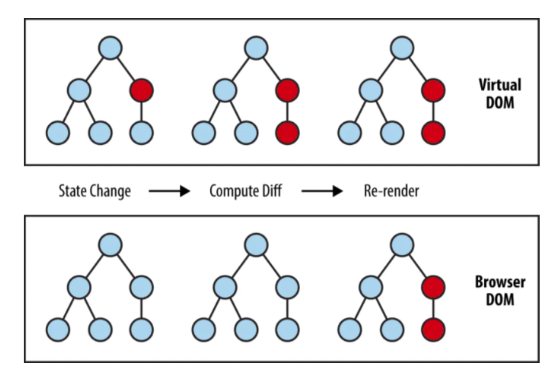

# 10 Introduction React

1. **React** adalah library javascript untuk membuat user interface (UI) yang interaktif dan cepat pada web maupun mobile.selain itu react merupakan library open source yang di maintain oleh Facebook. Pada arsitektur MVC(Model - View - Controller), ReactJs hanya akan mengambil peran pada layer View saja.

2. Kenapa menggunakan react? , karena react memiliki 3 point yang dijelaskan oleh react itu sendiri: Deklaratif, Component-based, dan Learn Once, Write Anywhere. Selain itu react juga sudah teruji, dan juga merupakan teknologi yang populer.

- Deklaratif -> salah satu pendekatan ketika ngoding, yang berfokus kepada tujuan yang kita capai.
- Component-base -> Berbasis komponen
- Learn Once, Write Anywhere -> ketika kita sudah membuat aplikasi web menggunakan react, maka kita juga sudah bisa membuat aplikasi IOS dan android menggunakan react native, yang konsepnya mirip dengan react.

3. **VDOM (Virtual DOM)** adalah representasi dari UI berbentuk javascript objek yang disimpan pada memori. 
