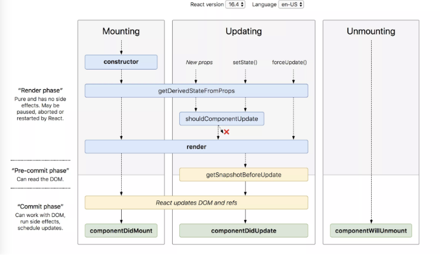

# 11 React Fundamental

1. **JSX** merupakan singkatan dari Javascript XML, Jsx adalah ekstensi java script yang digunakan untuk memudahkan kita dalam menulis aplikasi react, JSX dibuatkan berdasarkan fakta kalau logika rendering sangat terikat dengan logic UI, selain itu jsx juga merupakan sebuah expression, setelah dikompilasi, ekspresi jsx akan menjadi panggilan fungsi pada javaScript biasa dan menjadi objek JavaScript.

2. **Component** Komponen react adalah bagian kode yang dapat digunakan kembali,selain itu, Komponen React adalah kode yang digunakan untuk membuat tampilan, behavior, dan state sebagian UI. UI pada react, bisa dibagi menjadi beberapa komponen, hal itu memudahkan kita untuk membuat UI yang sederhana dan kompleks.

3. **React Life cycle** Life cycle method yang umum digunakan adalah:

- render() --> Fungsi yang paling sering dipakai, render ini diperlukan pada class component, dan fungsi render ini merupakan pure function, tidak boleh ada setState()

- componentDidMount() --> Fungsi ini dipanggil ketika component sudah di render untuk pertama kali, kemudian fungsi ini menjadi tempat yang tepat untuk pemanggilan API, dan boleh ada setState()

- componentDidUpdate() --> Fungsi ini dipanggil ketika terjadi update (props atau state berubah)
- componentWillUnmount() --> Fungsi ini dipanggil ketika komponent akan dihapus, cocok untuk clean up actions

