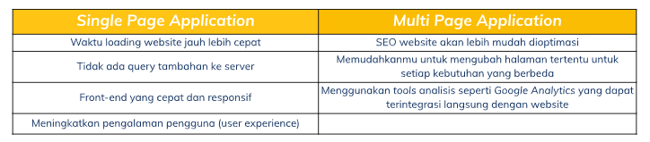
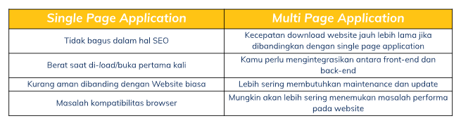

# 14 React Routing

1. **Router** merupakan modul dalam react yang berfungsi untuk melakukan proses navigasi pada SPA (Single Page Application). _Single Page Application_ adalah salah satu jenis aplikasi website dimana hanya ada 1 halaman yang menangani semua aktivitas yang terjadi dalam aplikasi tersebut. Sedangkan, _Multi Page Application_ yang juga biasa disebut dengan tradisional web app adalah jenis aplikasi website dimana perlu membuat ulang seluruh halaman web setiap kali membuat permintaan baru.

Keunggulan SPA dan MPA 

Kekurangan SPA dan MPA 

2. **Parameter URL** adalah suatu parameter yang nilainya ditetapkan secara dinamis di URL halaman.
   Perbedaan Link dan Redirect, kegunaan URL Parameter adalah untuk paginasi, penyortiran dan penyaringan, pencarian, dan penggambaran.

   | **LINK**                             | **REDIRECT**                            |
   | ------------------------------------ | --------------------------------------- |
   | Dapat digunakan pada kondisi apapun  | Lebih sering digunakan pada halaman 404 |
   | Memberikan History baru pada browser | Menimpa history pada browser            |
   | Bereaksi dengan click seperti a href | Bereaksi dengan suatu kondisi           |

3. **Hook Routing React** terdiri dari:

- useHistory --> Memberi kita akses ke instance riwayat yang dapat anda gunakan untuk bernavigasi.
- useLocation --> mengembalikan objek lokasi.
- useParams --> mengembalikan objek pasangan kunci/nilai parameter URL.
- useRouteMatch --> mencoba mencocokkan URL saat ini dengan cara yang sama seperti `<Route>`.
