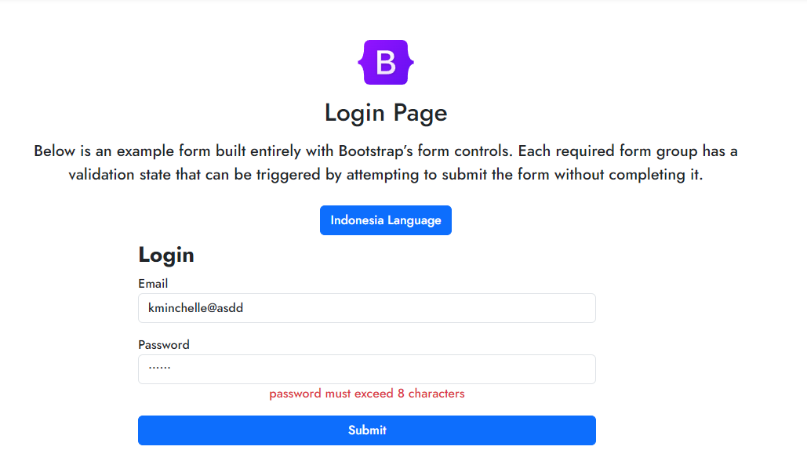
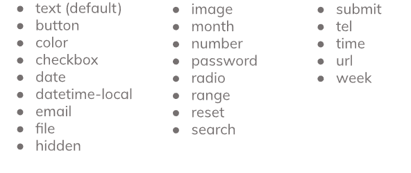
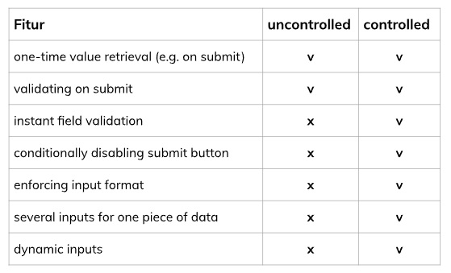
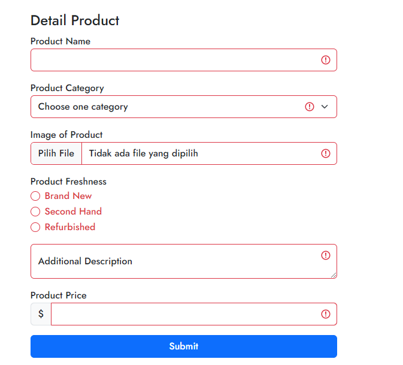

# 15 React Form

1. **Form** merupakan salah satu hal krusial dalam pengembangan aplikasi website, Form dapat digunakan untuk menghandle inputan dari user. Form banyak dijumpai ketika kita login, mendaftarkan sesuatu, memberikan feedback, mengisi data dan masih banyak lagi.   berikut adalah contoh dari form: 
   

berikut adalah macam macam form:  

2. **Uncontrolled Component** adalah input yang tidak terkontrol seperti input formulir HTMl tradisional, dengan kata lain, kita harus 'menarik' nilai dari field saat kita membutuhkannya, ini bisa terjadi ketika formulir di submit. Namun uncontrolled input tidak _powerful_. Maka dari itu, ada **Controlled Component**, Controlled Component merupakan sebuah controlled input yang menerima nilai saat ini sebagai prop, serta callback untuk mengubah nilai tersebut.   berikut adalah perbedaan fitur antara Controlled Component dan Uncontrolled Component  
   

3. **Basic Validation**, pada dasarnya ada 3 alasan kenapa validasi form diperlukan:

- _Mencari input data yang benar dan sesuai format_. Sebuah web/aplikasi tidak dapat berjalan dengan benar, jika data yang diolah tidak sesuai dengan kebutuhan aplikasi.
- _Melindungi akun pengguna_. Misalnya, membuat pengguna untuk memasukkan data password yang aman.
- _Melindungi sistem/aplikasi_. Validasi form yang kuat dapat meminimalisir perilaku pengguna yang ingin meretas sistem/aplikasi.  
  berikut adalah contoh validasi form 
  
