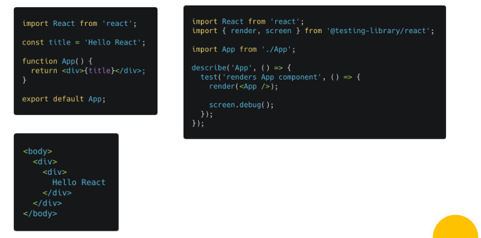
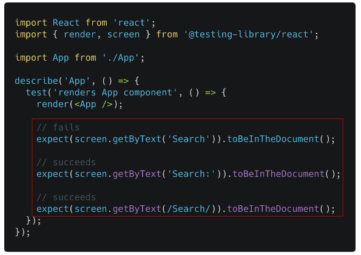
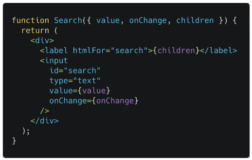
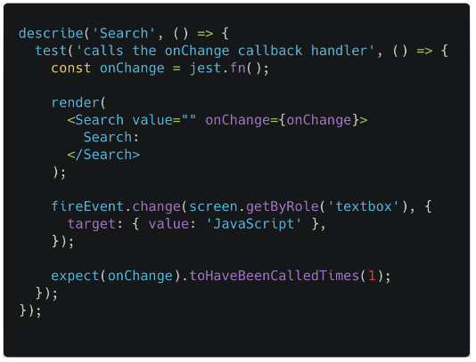
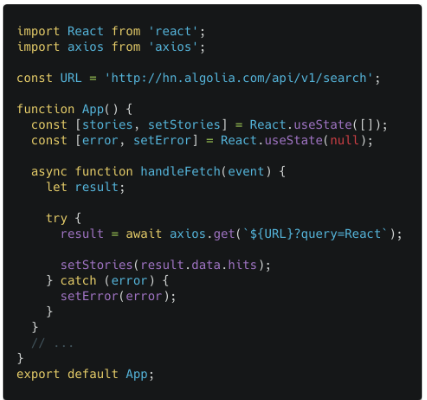
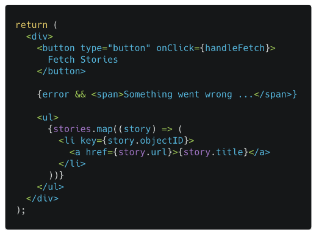
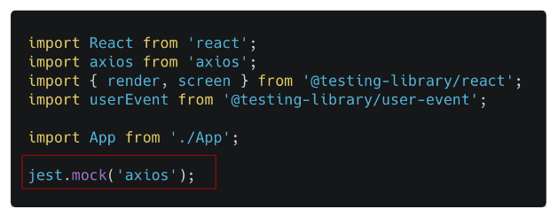
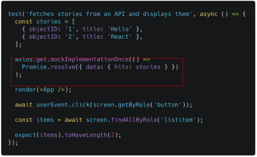
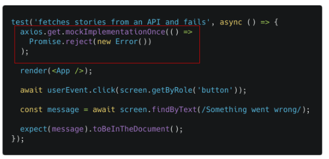

# 17 React Testing

1. **Testing** adalah proses memverifikasi bahwa test assertions kita benar dan bahwa code kita tetap benar sepanjang masa aplikasi. _Test assertions_ ini adalah ekspresi boolean yang mengembalikan nilai true kecuali ada bug di kode kita. Testing memiliki manfaat sebagai berikut:

- Ketika aplikasi kita mempunyai coverage yang baik, Kita akan merasa percaya diri jika harus mengubah suatu bagian pada aplikasi kita.
- Mengurangi bug pada aplikasi. Walaupun testing tidak menjamin aplikasi kita bebas bug, tetapi kita bisa mencegah beberapa hal yang berpotensi menjadi bug. 
  > Kategori Testing
  > Secara umum, cara mengetes di React terbagi menjadi dua kategori: yang pertama adalah Rendering component trees. dan yang kedua adalah Menjalani aplikasi lengkap didalam environment peramban (browser) asli. ini dikenal sebagai tes "end-to-end"

### Rekomendasi Tools

- Jest
- React testing library

2. **Testing rendering component (Render & Debug)**

- _Render RTL_ akan merender file JSX apapun yang dibutuhkan.
- _Debug RTL_ untuk meyakinkan bahwa file JSX sudah terender dengan baik.
   

**Memilih Elemen untuk di test** 
React Testing Library menawarkan berbagai fungsi untuk mendapatkan elemen. Kita dapat memilih elemen dengan fungsi object screen RTL. Salah satu contohnya adalah `getByText` untuk memilih teks dari elemen yang sudah dipilih.
 
contoh kategori testing lainnya yang dapat digunakan adalah:

- LabelText : `getByLabelText: <label for="search" />`
- PlaceholderText: `getByPlaceholderText: <input placeholder="Search" />`
- AltText: `getByAltText: `
- Display Value: `getByDisplayValue: <input value="JavaScript" />`

**Handle Event** 
berikut adalah contoh testing handle event.

**Handle Asynchronous** 
handle async ini digunakan ketika hendak mengetes fetch sebuah API. Pada case ini kita perlu membuat mock untuk axios (atau yang lain). 

##### fetch data  

 

##### fetch data  

 

##### mock axios menggunakan Jest  

 

##### mock axios menggunakan Jest  

 

##### mock axios menggunakan Jest  

 

3. **Testing Custom Hook**, Library yang digunakan untuk mengetes custom hook, biasanya menggunakan React Hooks Testing Library. Dia akan memberikan kita alat alat untuk mengetes hooks tanpa merender satu komponen. untuk menginstall nya kita dapat menjalankan command ini: `npm/yarn install -D @testing-library/react-hooks` untuk dokumentasi React Hooks Testing Library ini bisa diakses pada link [berikut](https://www.react-hooks-testing-library.com)
