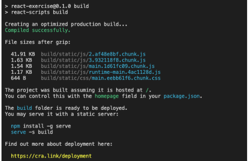
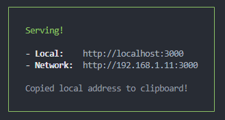
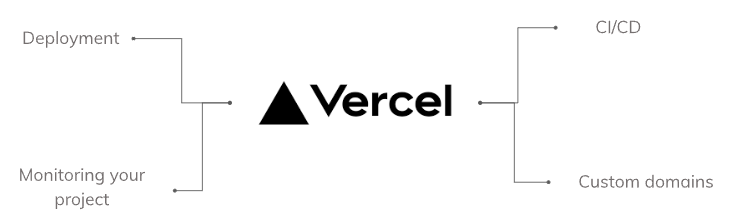

# 18 Deployment With Vercel

### 1) Build React App

Secara default, React mengandung banyak pesan peringatan, Peringatan-peringatan ini sangat berguna dalam pengembangan aplikasi. Namun, pesan-pesan ini membuat react menjadi lebih besar dan lambat. Oleh karenanya kita harus menggunakan versi produksi ketika men-deploy aplikasi react. Tujuan melakukan build adalah agar aplikasi kita menjadi versi production, sehingga performanya lebih ringan dan cepat. untuk melakukan build pada aplikasi yang dibuat menggunakan Create React App kita perlu menjalankan command: `npm run build` ini akan membuat versi produksi untuk aplikasi kita didalam folder build/. ini hanya diperlukan sebelum men-deploy ke produksi. Untuk pengembangan/development normal, tetap gunakan npm start. <br/>


### 2) Run Optimized App

Run optimized app ini berfungsi untuk menjalankan aplikasi yang optimal di lokal komputer kita, kita bisa menggunakan serve. dengan cara:

```
//install serve
npm install -g serve

//jalankan serve di lokal
serve -s build
```

<br/>
**untuk info lebih lengkapnya kunjungi [link berikut](https://cra.link/deployment)**

### 3) Vercel

Vercel merupakan platform end-to-end untuk developer, yang memungkinkan kita untuk membuat dan men-deploy aplikasi web kita.<br/>
<br/>
