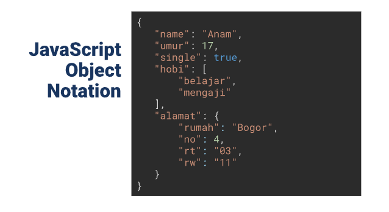

# 19 Introduction Restfull API

### 1) API (Application Programming Interface)

API (Application Programming Interface) adalah seperangkat aturan dan protokol yang digunakan oleh program komputer untuk berkomunikasi satu sama lain. API adalah sebuah aplikasi programming antarmuka yang memungkinkan berbagai aplikasi perangkat lunak berinteraksi, berbagi data, atau menjalankan fungsi tertentu. API memungkinkan developer untuk mengintegrasikan fungsionalitas atau data dari satu aplikasi ke aplikasi lain tanpa perlu menulis ulang seluruh kode dari awal. 

 

### 2) REST (Representational State Transfer)

REST adalah salah satu pendekatan arsitektur yang paling umum digunakan dalam pengembangan layanan web karena sederhana, mudah dipahami, dan dapat digunakan dengan berbagai bahasa pemrograman. Ini memungkinkan pengembang untuk membangun aplikasi yang dapat diakses melalui HTTP dengan mudah dan efisien. 

### 3) JSON (JavaScript Object Notation)

JSON (JavaScript Object Notation) adalah format data yang ringan, mudah dibaca, dan mudah ditulis. JSON digunakan untuk pertukaran data antara komputer dan sering digunakan dalam pengembangan aplikasi web sebagai format untuk mengirim data antara server dan klien, serta untuk menyimpan data dalam berkas konfigurasi.

 

