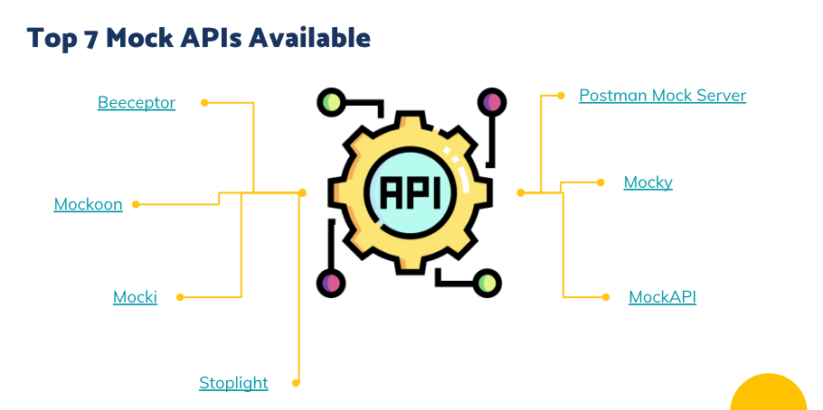
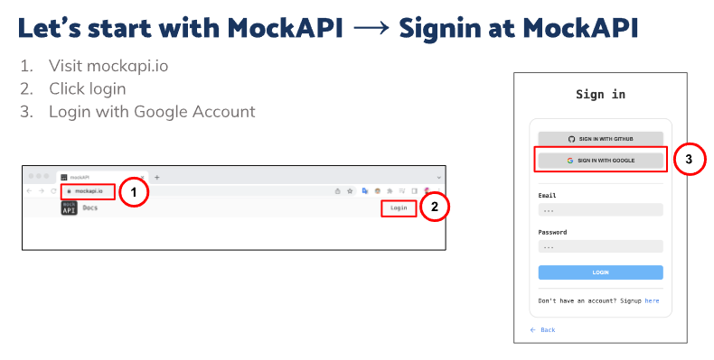
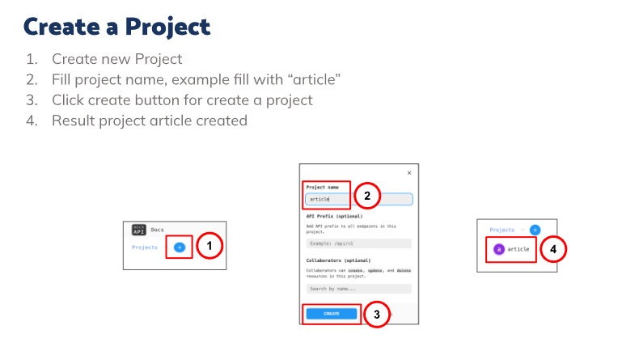
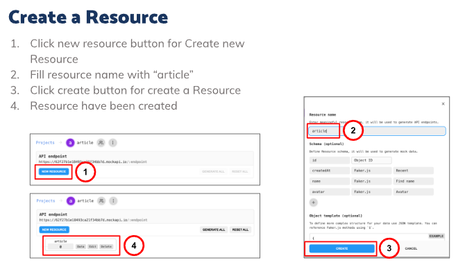
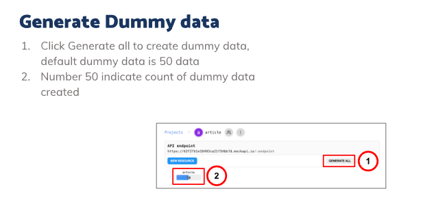
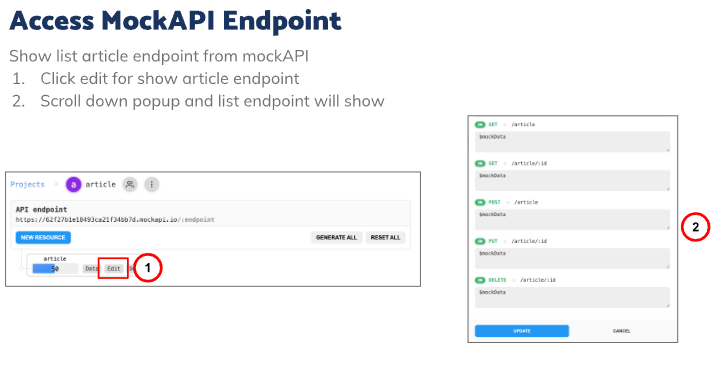
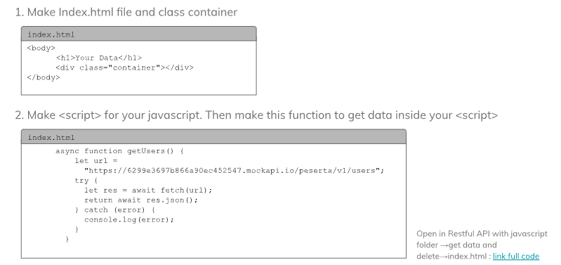
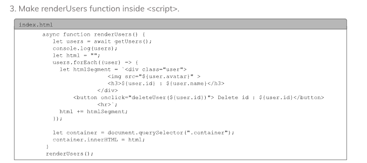

# 20 Restfull API with JavaScript

### 1) Mock API/Public API

Untuk mendapatkan API (Application Programming Interface) kita bisa menggunakan public API untuk contoh data atau contoh endpoint, yang biasanya disebut fake API (API Palsu), API tiruan adalah ketika sedang membangun API yang mengembalikan data yang diinginkan. kesimpulannya manfaat dari Mock API (API tiruan) adalah:

1. Frontend and back-end developers can work simultaneously
2. Fast feedback loop
3. Finding issues early and fast
4. Developing tests and APIs simultaneously

### 2) Create Mock API with MOCKAPI.IO

 
 
 
 
 

### 3) Implementation Get Data and Render

 

