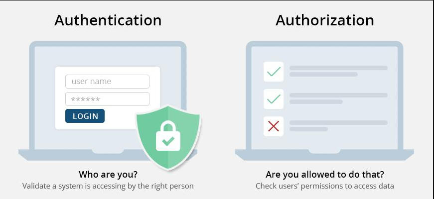
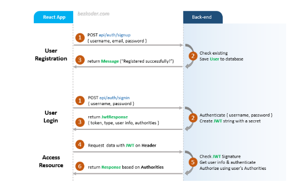
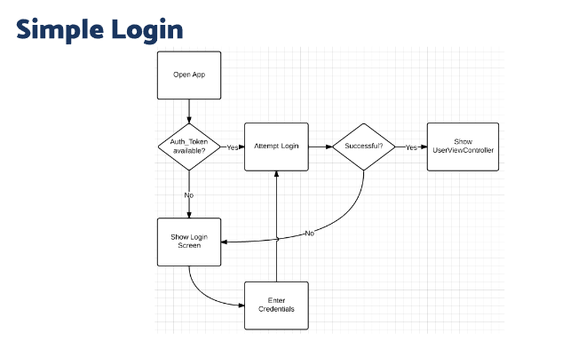

# 21 Authentication in React

### 1) Authorization

Otorisasi adalah proses yang memutuskan apa yang diperbolehkan atau dilarang bagi pengguna atau entitas tertentu dalam sebuah sistem atau aplikasi setelah mereka berhasil melewati proses autentikasi. Dalam konteks sistem atau aplikasi, otorisasi mengontrol hak akses individu atau peran ke sumber daya dan fungsi yang berbeda. Ini berarti menentukan apa yang dapat dilakukan atau diakses oleh pengguna setelah mereka berhasil masuk atau autentikasi.

### 2) Authentication

Autentikasi dalam React merujuk pada proses memverifikasi identitas pengguna atau sistem sebelum memberikan akses ke bagian tertentu dari sebuah aplikasi web atau fungsi tertentu. Ini adalah aspek penting dalam pengembangan web, terutama untuk aplikasi yang memerlukan data khusus pengguna atau konten yang terbatas.

 

#### Full Auth Work

### 3) Login in React

Dalam keamanan komputer, Login adalah proses di mana seseorang memperoleh akses ke sistem komputer dengan mengidentifikasi dan mengautentikasi dirinya sendiri. Login ini sangat sering digunakan pada beberapa aplikasi atau web, sebagai contoh Instagram, Facebook, twitter, linkedin, dsb.

#### Contoh Alur Login Sederhana

