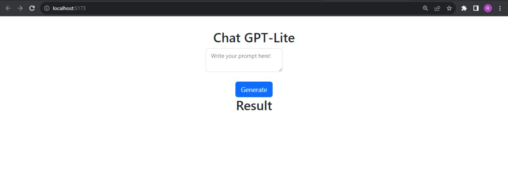
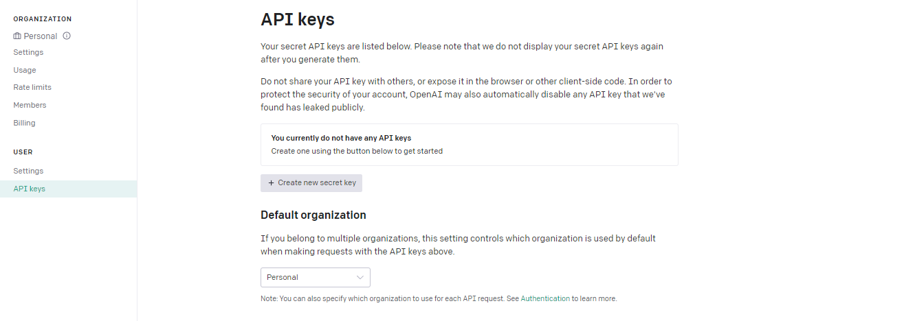
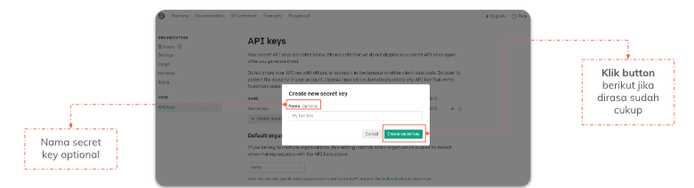
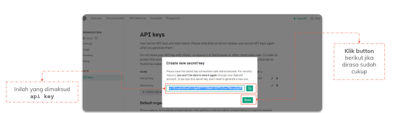
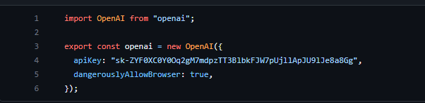

# 23 Installation Open AI in React

### 1) Kenapa Open AI?

- **Gratis (trial)**
- **Mudah dipasang**
- **Dipakai Banyak User**
- **Jumlah Parameter: 175 Miliar (model davinci 03)**

> [Link documentation OpenAI](https://platform.openai.com/docs/introduction)<br/>
> [Untuk Menginstall OpenAI klik disini](https://platform.openai.com/docs/api-reference)<br/>
> Installation OpenAI with React-vite Repository [React-OpenAI](https://github.com/aaaroz/react-openAI)


### 2) Pemasangan Open AI di React

- Membuat React Project (via CRA or Vite)<br/>
  Code : `npx create-react-app my-app` or `npm create vite`
- Install OpenAI Package <br/>
  Bukalah terminal dan masukkan perintah `npm install openai react-hook-form react-markdown react-bootstrap bootstrap`
- Didalam folder `/src` buat file `configs/openai.js` lalu isikan code berikut<br/>
  Code :<br/>

```
import OpenAI from 'openai';

export const openai = new OpenAI({
    apiKey: "masukan_apiKey_OpenAI_disini",
    dangerouslyAllowBrowser: true
})
```

- Kemudian pada file `App.jsx` masukkan code berikut
  Code:<br/>

```
import { useState } from "react";
import { useForm } from "react-hook-form";
import { Form } from "react-bootstrap";
import Markdown from "react-markdown";
import "./App.css";
import { openai } from "./configs/openai";

function App() {
  const [result, setResult] = useState("");
  const [isLoading, setIsLoading] = useState(false);

  const {
    register,
    handleSubmit,
    formState: { errors },
  } = useForm();

  const onSubmit = (data) => {
    setIsLoading(true);
    const result = openai.chat.completions
      .create({
        messages: [{ role: "user", content: data.prompt }],
        model: "gpt-3.5-turbo",
      })
      .then((result) => {
        console.log(result);
        setResult(result.choices[0].message.content);
        setIsLoading(false);
      });
    console.log(data);
  };

  return (
    <>
      <div className="container d-flex justify-content-center">
        <Form onSubmit={handleSubmit(onSubmit)}>
          <h2>Chat GPT-Lite</h2>
          <div className="form-floating mb-3 pe-5">
            <textarea
              id="prompt"
              type="text-area"
              className="form-control"
              {...register("prompt", { required: true })}
            ></textarea>
            <label htmlFor="prompt">Write your prompt here!</label>
          </div>
          <button type="submit" className="btn btn-primary mt-2">
            {isLoading ? "Generating..." : "Generate"}
          </button>
        </Form>
      </div>
      <div className="align-start">
        <h2>Result</h2>
        <Markdown>{result}</Markdown>
      </div>
    </>
  );
}

export default App;
```

- setelah itu buka terminal lalu ketik `npm run dev`
  maka akan terlihat hasil seperti ini: <br/>
  
  

### 3) Mendapatkan API Keys

1. Buka situs web openAI di [API Reference - OpenAI API](https://platform.openai.com/docs/api-reference) menggunakan browser web anda.
2. Lakukan login pada situs OpenAI Flatform, jika belum mempunyai account maka lakukan signup terlebih dahulu.
3. Kemudian jika sudah login pada Flatform OpenAI, cari bagian _introduction_ dan masuk ke API keys atau masuk ke halaman berikut [OpenAI - API Key](https://platform.openai.com/account/api-keys)
4. setelah masuk kehalaman API Key, klik pada button `Create new secret key`
   
5. setelah mengklik button maka akan muncul halaman seperti dibawah ini, lalu ikuti petunjuk untuk mengkonfigurasi API Key sesuai kebutuhan.
   
6. kemudian, copy semua api key kalian. lalu kembali ke project react yang tadi sudah dibuat.
   
7. Masukkan API key, yang sudah di copy tadi ke dalam project react pada bagian `configs/openai.js`
   
8. Jika semua langkah sudah dilakukan dengan benar, maka react project with openai kalian sudah berhasil.

> Untuk Code lebih jelas bisa diakses pada repository [React-OpenAI](https://github.com/aaaroz/react-openAI)
