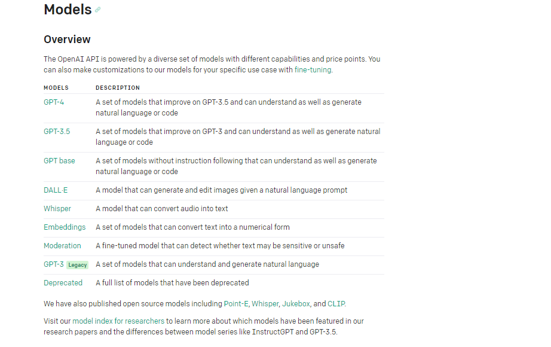
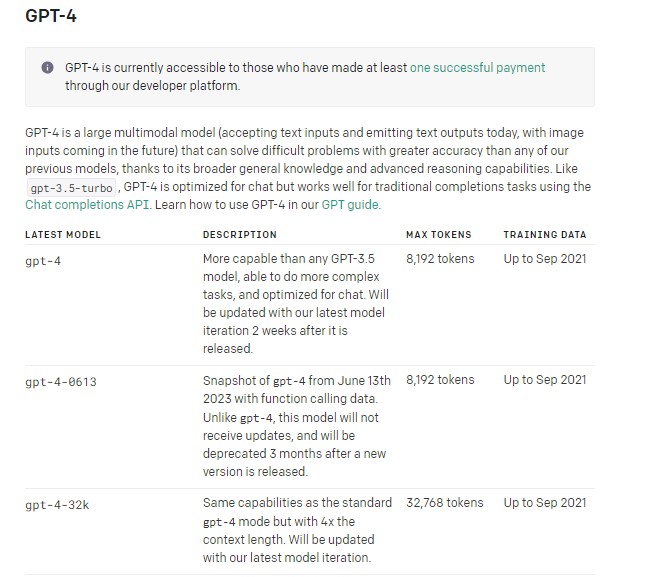
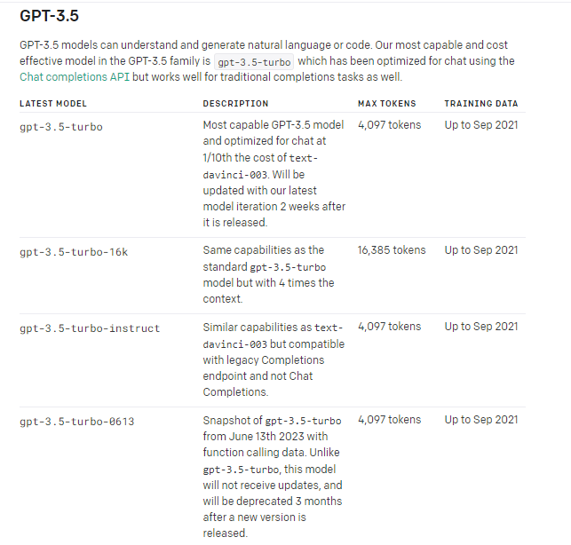
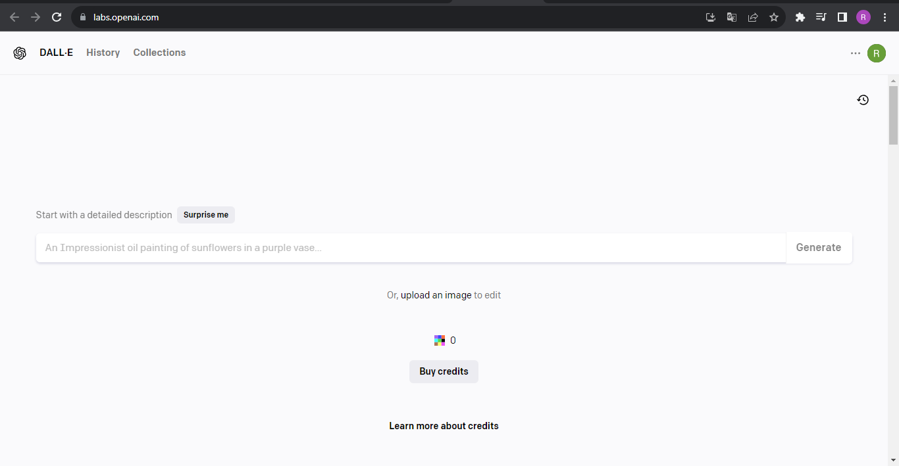
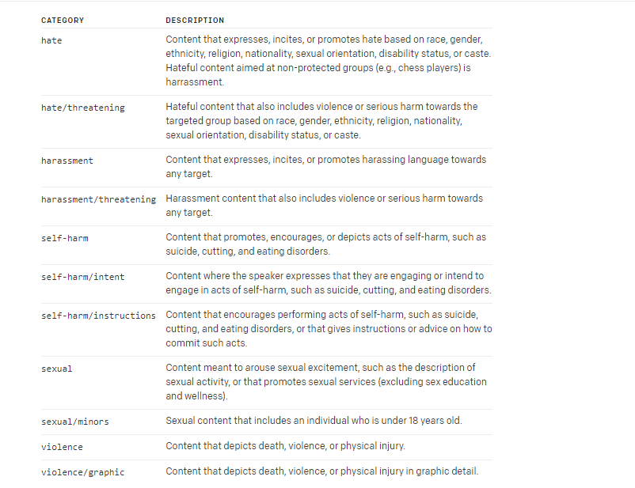
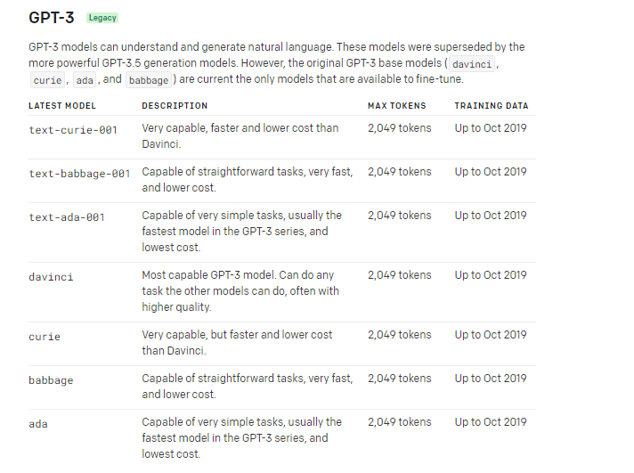
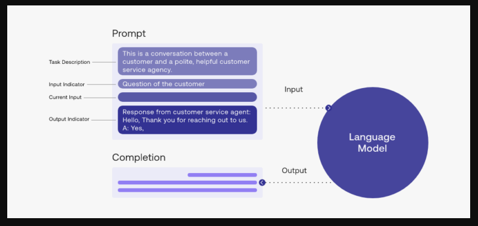
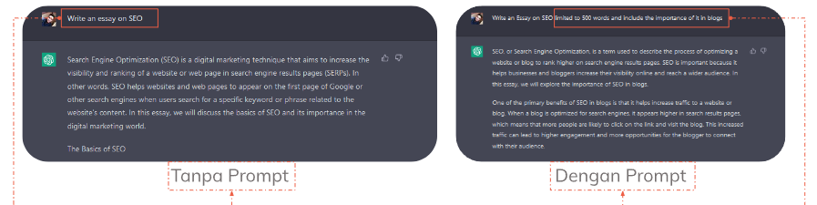
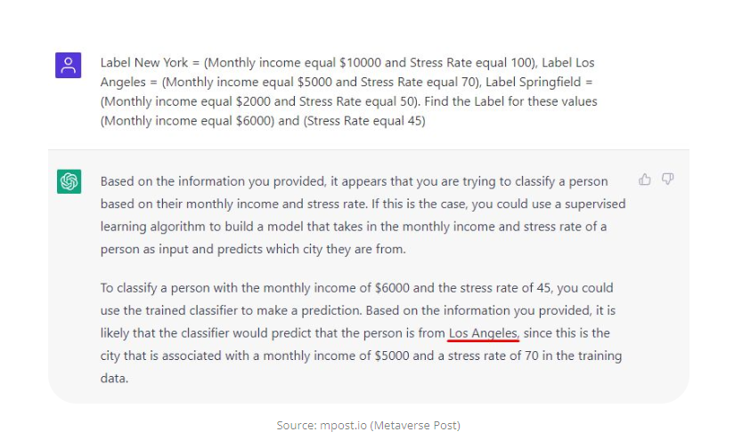

# 24 Basic Model OpenAI dan Prompt Engineer di React

### 1) Keuntungan Mempelajari Basic Model OpenAI dan Prompt

Dengan mempelajari model dan prompt kita akan mendapatkan keuntungan :

1. Meningkatkan penggunaan model OpenAI
2. Mengoptimalkan Output model OpenAI
3. Menjadi bagian dari Komunitas AI
4. Membangun Aplikasi AI yang lebih relevan
5. Meningkatkan daya saing di bidang AI

### 2) Basic Model OpenAI

Model OpenAI pada platform Openai.com adalah sebuah sistem kecerdasan buatan (AI) yang dapat digunakan untuk mempelajari pola-pola dari data dan menghasilkan output yang sesuai dengan data yang diberikan. berikut adalah beberapa contoh basic model pada OpenAI:

##### GPT-4

GPT-4 adalah model bahasa alami (NLP) generasi baru yang dikembangkan oleh OpenAI setelah GPT-3.5. Diharapkan memiliki lebih dari 10 triliun parameter. 
 
List Model pada GPT-4

##### GPT-3.5

GPT-3.5 adalah model bahasa alami (NLP) generasi baru yang dikembangkan oleh OpenAI setelah GPT-3. Model ini memiliki 6 miliar parameter, dan juga memiliki beberapa fitur baru seperti kemampuan untuk mengenali bahasa kode dan kemampuan untuk menyelesaikan masalah matematika. 
 
List Model pada GPT-3.5

##### DALL-E

DALL-E adalah model pembangkit gambar generatif yang dikembangkan oleh OpenAI. Memiliki lebih dari 12 miliar parameter. 
 
DALL-E User Interface, atau bisa kunjungi [disini](https://labs.openai.com/)

##### Whisper

Whisper adalah model pengenalan suara untuk keperluan umum. Menggunakan Python 3.9.9 dan PyTorch 1.10.1. Untuk mengenal lebih dalam tentang Model whisper klik [Dokumentasi Model Whisper - OpenAI](https://platform.openai.com/docs/models/overview)

##### Embeddings

Embeddings mengukur keterkaitan antara dua bagian teks. Biasa digunakan pada :

- Mencari (Search)
- Kelompokkan (Clustering)
- Rekomendasi (Recommendations)
- Deteksi Anomali (Anomaly Detection)
- Pengukuran Keragaman (Diversity Measurement)
- Klasifikasi (Classification) 
  Untuk mempelajari lebih lanjut klik [Blog terkait Embeddings](https://openai.com/blog/new-and-improved-embedding-model)

##### Moderation

Moderation Model adalah model pembelajaran mesin yang dirancang untuk memeriksa apakah konten sesuai dengan [kebijakan penggunaan OpenAI](https://platform.openai.com/docs/guides/moderation/overview) 
Kategori yang ada pada Moderation 

##### GPT-3

Model generasi bahasa alami berbasis Transformer yang dikembangkan oleh OpenAI. 
 
List Model pada GPT-3

##### Codex

Model yang telah usang dan kemampuannya disempurnakan lewat GPT-3. Model ini sudah diberi label `Deprecated` oleh OpenAI, yang berarti model ini sudah tidak dianjurkan lagi.  

### 3) Basic Prompt Engineer

Prompt Engineering adalah teknik yang digunakan untuk mengoptimalkan output dari model AI dengan memberikan prompt atau intruksi pada model tersebut. 
 
struktur dasar prompt

##### Contoh Prompt Engineer

##### Contoh penggunaan (Text Classification)

Sama seperti mengelompokkan mainan kita kedalam kotak penyimpanan mainan.

##### Readmore ?

[Contoh-contoh lain yang relevan](https://platform.openai.com/examples)
